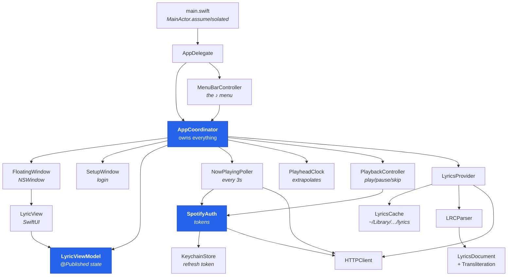
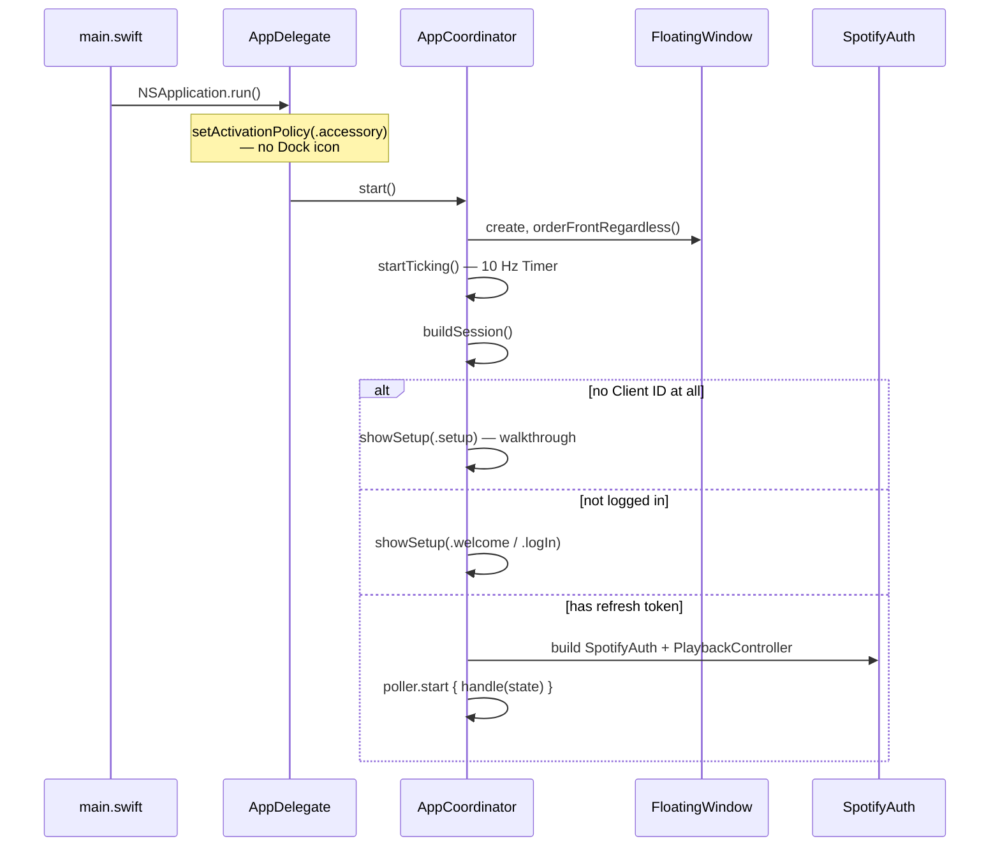
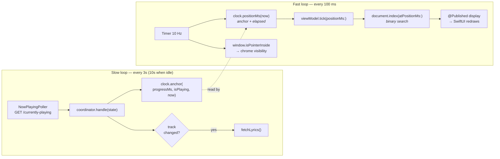
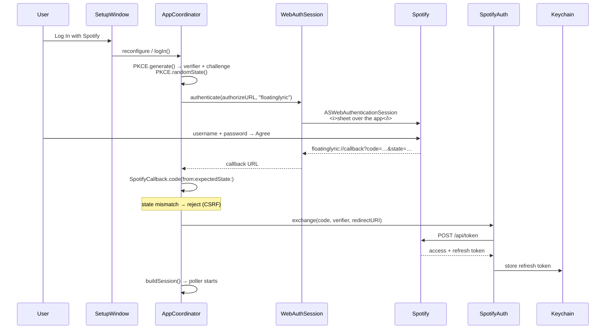
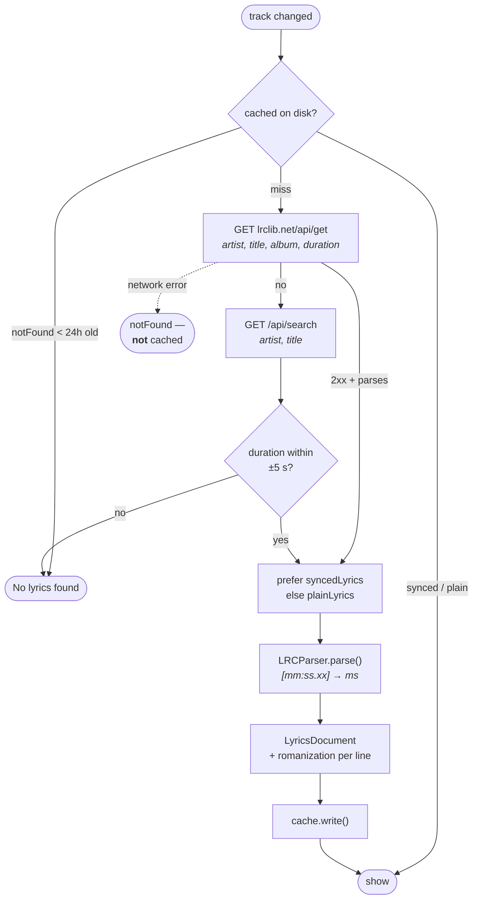
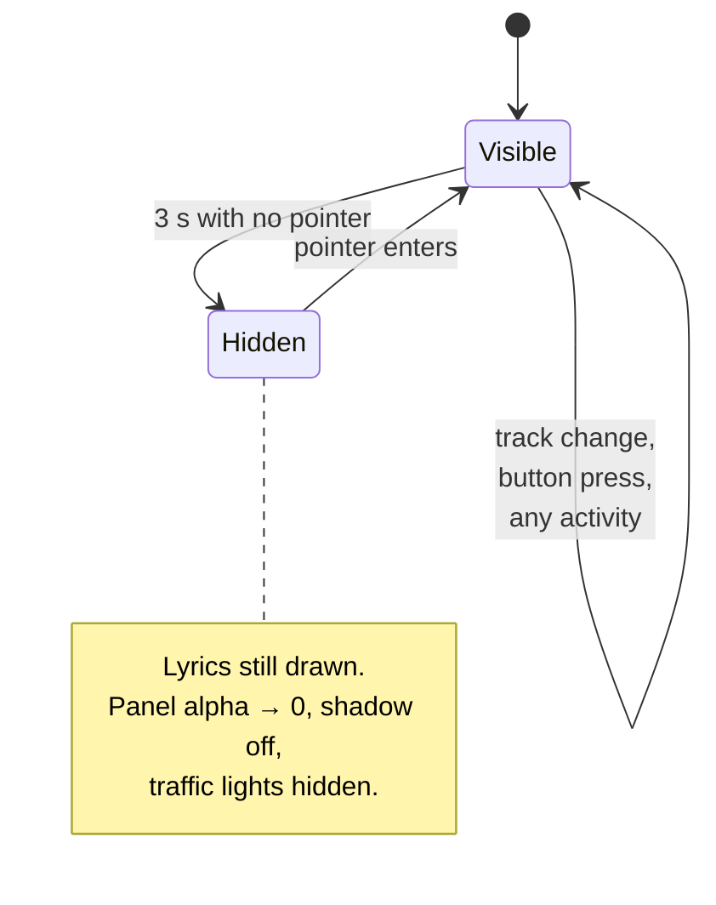
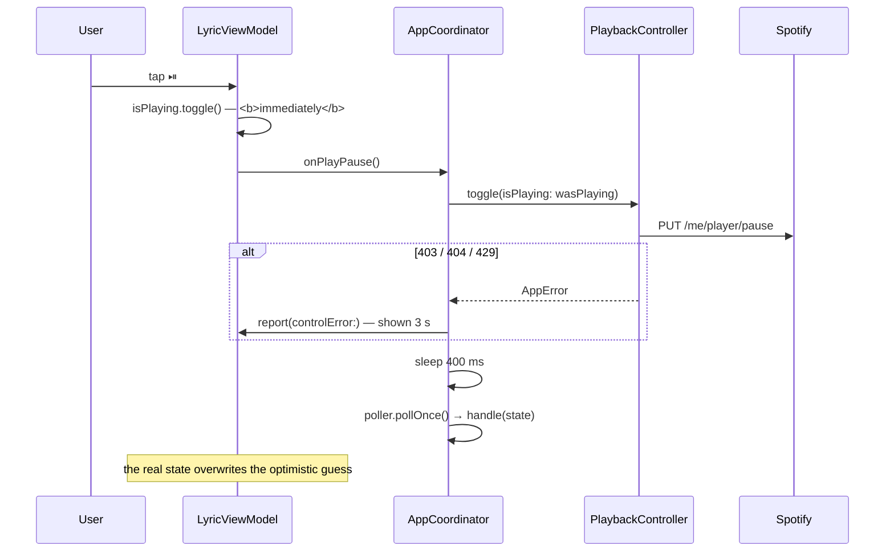
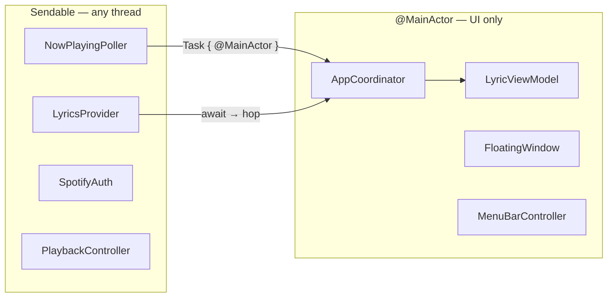

# How FloatingLyric works

A tour of the macOS code, for anyone learning the codebase — or porting it.
Diagrams are Mermaid, so GitHub renders them inline.

Paths are relative to [`../macos/`](../macos/).

---

## 1. Where to start reading

If you read four files, read these, in this order:

| File | Why |
|---|---|
| `App/AppCoordinator.swift` | The spine. Owns everything and wires it together. |
| `Playback/PlayheadClock.swift` | 32 lines, and the reason lyrics look smooth. |
| `UI/LyricViewModel.swift` | Every piece of state the window draws. |
| `Lyrics/LyricsProvider.swift` | The fetch-and-cache policy, in one place. |

Everything else hangs off those.

## 2. The shape of it

Five groups. Arrows point the way calls flow — nothing points back up, which
is what keeps the lower layers testable.



**The rule that makes it hang together:** `AppCoordinator` is the only type
that knows about more than its own neighbours. Nothing else reaches sideways.

## 3. Starting up



`LoginPrompt.required(clientID:isLoggedIn:hasSignedInBefore:)` makes that
three-way choice, and it's a pure function — which is why it has tests and the
window it opens doesn't need any.

## 4. The two loops

This is the heart of the app, and the one thing to understand if you
understand nothing else.

Spotify is polled **every 3 seconds**. Lyrics need to be right **every
frame**. Those are different clocks, and the gap between them is bridged by
extrapolation rather than by polling harder.



`PlayheadClock` is the whole trick, and it is 32 lines:

```
position = anchorProgress + (now − anchorTime)     while playing
position = anchorProgress                          while paused
```

Every poll re-anchors, so ordinary drift, a pause, and a seek all correct
themselves through one mechanism. There is no special case for any of them.

> **Why not poll faster?** Spotify rate-limits, and a 10 Hz poll would be
> antisocial and still not smooth. Extrapolation costs nothing and is exact
> between anchors.

## 5. Logging in — OAuth 2.0 with PKCE

No client secret exists anywhere in this app. PKCE replaces it: a random
`verifier` is generated per login, its SHA-256 `challenge` is sent up front,
and the verifier is only revealed when redeeming the code. Intercepting the
code alone gets you nothing.



If the sheet cannot be presented at all, `AppError.authUnavailable` sends the
coordinator down `logInWithBrowser`, the older flow: default browser plus a
one-shot local listener on port 8888–8890. User cancellation deliberately does
**not** trigger that fallback.

Afterwards, `SpotifyAuth.accessToken()` is the only way anything gets a token.
It refreshes when fewer than 60 seconds remain, so no caller ever thinks about
expiry.

## 6. Getting the lyrics



The distinction that matters: **"no lyrics exist" is cached for 24 hours; "the
network failed" is never cached.** Get that backwards and one flaky moment
poisons a song forever.

Romanization happens once here, at document construction — never in the view,
which redraws ten times a second.

## 7. Chrome visibility

After 3 idle seconds, everything but the lyrics fades: header, progress bar,
transport, traffic lights, and the blurred panel itself.



Three details that each cost a bug:

- **Hover is polled**, not tracked — `FloatingWindow.isPointerInside` tests the
  mouse location against the window rect. This app is usually not the active
  one, and enter/exit events don't reliably reach a background window.
- **The blur is a sibling of the lyrics, not their parent.** Fading a parent
  fades its children; the words have to outlive the panel.
- **Hovering lifts opacity to a 35 % floor.** Without it, dragging the slider
  to 0 % leaves a window nobody can find again.

## 8. Pressing play



The optimistic flip is deliberate. Spotify applies commands asynchronously; a
button that waits for the next poll feels broken, so it lies for 400 ms and
then tells the truth.

## 9. Who runs on which thread



Everything that touches AppKit or SwiftUI is `@MainActor`. Everything that does
network work is `Sendable` and runs anywhere. The boundary is crossed in
exactly one direction, with an explicit hop.

## 10. Why so much of it is testable

173 tests run in about half a second, with no network and no window server.
That's not luck — decisions are pulled out into pure types that take their
inputs as arguments:

| Type | Decides | Notice |
|---|---|---|
| `PlayheadClock` | where the playhead is | takes `now` as a parameter |
| `ChromeVisibility` | is the chrome shown | takes `now` and `lastActivity` |
| `LoginPrompt` | which login screen | takes the stored state |
| `PanelOpacity` | alpha from percent | no window involved |
| `PanelToggle` | show / hide / restore | takes two booleans |
| `SpotifyCallback` | is this callback valid | takes a URL |
| `LRCParser` | text → timed lines | a string in, an array out |

None of them read a clock, a `UserDefaults`, or a window. The awkward,
untestable parts — AppKit, timers, the network — are kept thin and stupid on
purpose, and `StubHTTPClient` covers the rest.

---

## Reading the rest

- Behaviour to match when porting: [`porting.md`](porting.md)
- Using the app: [`../macos/README.md`](../macos/README.md)
- Original design and plan: [`superpowers/`](superpowers/)
